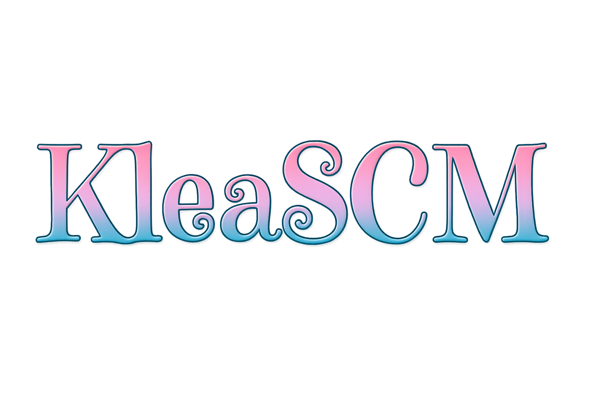

  

<!-- Auto type because yes -->

  

<!-- Language badges -->

  
  
  

<!-- framework badge 1 -->

  
  
  
  
  
  
  

<!-- DB badges-->

  
  
  
  
  

<!-- freamework badges 2 -->

  
  
  
  

<!-- GH stats -->

  
  
  

<!-- strophy  -->
<!-- 🏆 GitHub Trophies -->

  

  

<!-- 🧠 SHANDRIS -->

  

> A Rust-powered cognitive AI engine featuring modular memory architecture, trait-based personality evolution, and context-aware emotional state modeling. Designed for adaptive behavior, persistent identity tracking, and intelligent prompt construction.

<!-- tech used badges -->

  
  
  

<!-- 🖥️ GREMLINCLI -->

  

> A modular developer CLI tool built in Rust for managing project scaffolding, categorized script execution, and workflow automation. Features a text-based UI using `ratatui`, dynamic command mapping, and a persistent, navigable dashboard interface designed for efficient terminal-based development.

<!-- tech used badges -->

  
  

<!-- 🐚 KDEMON -->

  

> A fast, keyboard-driven application launcher for Linux, designed to run as a systemd user service or via desktop file. Kdemon offers quick access to files and applications through a minimal, borderless interface. It features global hotkey support, fuzzy matching for intuitive navigation, real-time file system monitoring, and a default dark theme. Built with a modular architecture utilizing Rust, Iced for the UI, and notify-rs for file system events.

<!-- tech used badges -->

  
  
  

<!-- 🧲 RUST PHYSICS ENGINE -->

  

> A real-time physics engine written in Rust, implementing rigid body dynamics with quaternion rotation, semi-implicit Euler integration, and narrow-phase collision detection using the Separating Axis Theorem (SAT). Supports impulse-based collision resolution with friction, restitution, and positional correction. Includes spatial hashing for broad-phase optimization and a custom math module for vector, matrix, and quaternion operations.

<!-- tech used badges -->

  

<!-- 🌍 GEOGO -->

  

> GeoGO is a geospatial system that allows users to query meteorite impact locations worldwide. It provides a RESTful interface for retrieving meteorite data, searching for nearby impacts, and analyzing their distribution based on real-world scientific datasets. It also includes a Next.js frontend that displays these meteorites on an interactive map, showcasing the power of Go and geospatial technologies.
> Go-based geospatial API with PostGIS, Redis caching, Leaflet.js frontend, and meteorite search tools.

<!-- tech used badges -->

  
  
  

---
<!-- Dev Quote -->

---
<!-- start of scocial shit -->

  
  
  
  
  

